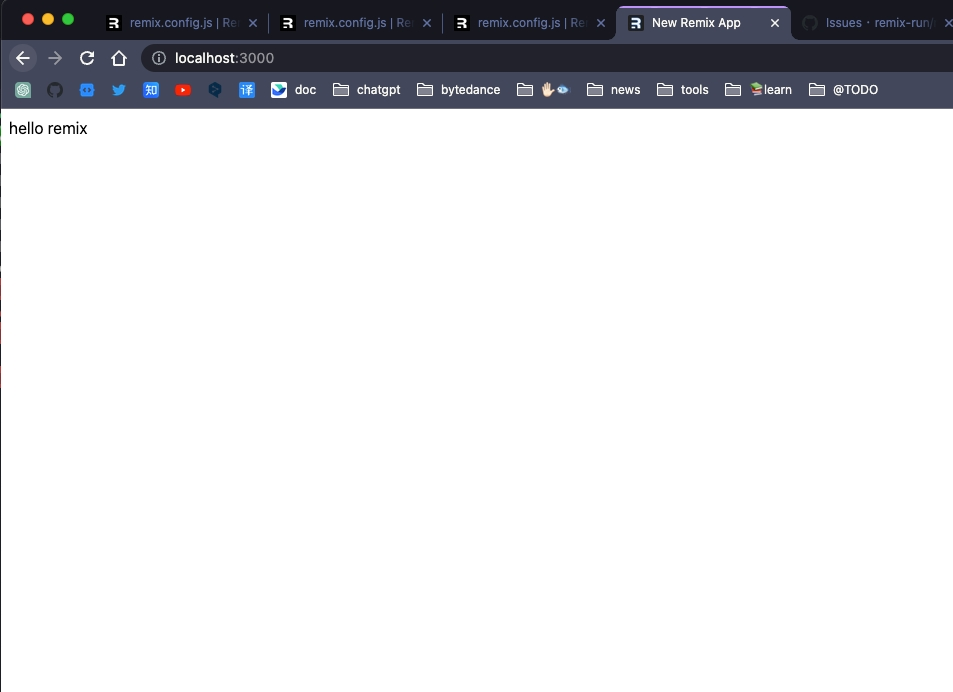

# intro

I want to use esm on nodejs. In `remix.config.js` means that:

```js
/** @type {import('@remix-run/dev').AppConfig} */
module.exports = {
  ...restRemixConfigs,
  serverModuleFormat: "esm",
  serverPlatform: "node",
};
```

# how?

## chore

1. add `"type": "module"` into `package.json`:

```diff
+ "type": "module"
```

2. refact `server.ts`:

   - `server.ts` => `server.cts`
   - update `package.json`
   - `require()` => `await import()`

**package.json**

```diff
- "dev:node": "cross-env NODE_ENV=development tsx --watch ./server.ts",
- "start": "cross-env NODE_ENV=production tsx ./server.ts",

+ "dev:node": "cross-env NODE_ENV=development tsx --watch ./server.cts",
+ "start": "cross-env NODE_ENV=production tsx ./server.cts",
```

> I use tsx to replace nodemon. It doesn't matter

**server.cts**

```diff
- const MODE = process.env.NODE_ENV;
- app.all(
-   "*",
-   MODE === "production"
-     ? createRequestHandler({ build: require(BUILD_DIR), mode: MODE })
-     : (...args) => {
-         purgeRequireCache();
-
-         return createRequestHandler({
-           build: require(BUILD_DIR),
-           mode: MODE,
-         })(...args);
-       }
- );
-
- const port = process.env.PORT || 3000;
- app.listen(port, () => {
-   console.log(`✅ Express server listening on port ${port}`);
- });

+bootstrap();
+
+async function bootstrap() {
+  const MODE = process.env.NODE_ENV;
+  const build = await import(BUILD_DIR);
+  app.all(
+    "*",
+    MODE === "production"
+      ? createRequestHandler({ build, mode: MODE })
+      : (...args) => {
+          purgeRequireCache();
+
+          return createRequestHandler({
+            build,
+            mode: MODE,
+          })(...args);
+        }
+  );
+
+  const port = process.env.PORT || 3000;
+  app.listen(port, () => {
+    console.log(`✅ Express server listening on port ${port}`);
+  });
+}
```

2. make `remix.config.js` support esm & commonjs in the meantime

```diff
/** @type {import('@remix-run/dev').AppConfig} */
const remixConfigs = {
  ignoredRouteFiles: ["**/.*"],
  // appDirectory: "app",
  // assetsBuildDirectory: "public/build",
  // serverBuildPath: "build/index.js",
  // publicPath: "/build/",
  future: {
    v2_errorBoundary: true,
    v2_meta: true,
    v2_normalizeFormMethod: true,
    v2_routeConvention: true,
  },
+  serverModuleFormat: "esm",
+  serverPlatform: "node",
};

- module.exports = remixConfigs;

+ const { ignoredRouteFiles, future, serverModuleFormat } = remixConfigs;
+ export { ignoredRouteFiles, future, serverModuleFormat };
```

## Add a pure ESM containing a top-level Await expression.

### workspace `shared`

```sh
$ pnpm --filter remix-node-cjs --filter remix-node-esm add shared
```

> shared: packages/shared

```js
async function asyncFunction() {
  return "hello remix";
}
const topLevelAwait = await asyncFunction();
export { asyncFunction, topLevelAwait };
```

### `remix-node-cjs` will report an error

```sh
➜  remix-node-esm git:(main) ✗ pnpm --filter remix-node-cjs dev

> remix-node-cjs@ dev /Users/workspace/remix-node-esm/packages/remix-node-cjs
> npm-run-all build --parallel "dev:*"


> remix-node-cjs@ build /Users/workspace/remix-node-esm/packages/remix-node-cjs
> remix build

Building Remix app in production mode...
Built in 185ms

> remix-node-cjs@ dev:node /Users/workspace/remix-node-esm/packages/remix-node-cjs
> cross-env NODE_ENV=development tsx --watch ./server.ts


> remix-node-cjs@ dev:remix /Users/workspace/remix-node-esm/packages/remix-node-cjs
> remix watch

(node:24410) ExperimentalWarning: Watch mode is an experimental feature. This feature could change at any time
(Use `node --trace-warnings ...` to show where the warning was created)
Watching Remix app in development mode...
✅ Express server listening on port 3000
💿 Built in 208ms
Error: Transform failed with 1 error:
/Users/workspace/remix-node-esm/packages/shared/dist/index.js:4:22: ERROR: Top-level await is currently not supported with the "cjs" output format
    at failureErrorWithLog (/Users/workspace/remix-node-esm/node_modules/.pnpm/esbuild@0.17.16/node_modules/esbuild/lib/main.js:1636:15)
    at /Users/workspace/remix-node-esm/node_modules/.pnpm/esbuild@0.17.16/node_modules/esbuild/lib/main.js:837:29
    at responseCallbacks.<computed> (/Users/workspace/remix-node-esm/node_modules/.pnpm/esbuild@0.17.16/node_modules/esbuild/lib/main.js:697:9)
    at handleIncomingPacket (/Users/workspace/remix-node-esm/node_modules/.pnpm/esbuild@0.17.16/node_modules/esbuild/lib/main.js:752:9)
    at Socket.readFromStdout (/Users/workspace/remix-node-esm/node_modules/.pnpm/esbuild@0.17.16/node_modules/esbuild/lib/main.js:673:7)
    at Socket.emit (node:events:513:28)
    at addChunk (node:internal/streams/readable:315:12)
    at readableAddChunk (node:internal/streams/readable:289:9)
    at Socket.Readable.push (node:internal/streams/readable:228:10)
    at Pipe.onStreamRead (node:internal/stream_base_commons:190:23)
GET / 500 - - 164.431 ms
```

```sh
➜  remix-node-esm git:(main) ✗ pnpm --filter remix-node-cjs build

> remix-node-cjs@ build /Users/workspace/remix-node-esm/packages/remix-node-cjs
> remix build

Building Remix app in production mode...
Built in 187ms
➜  remix-node-esm git:(main) ✗ pnpm --filter remix-node-cjs start

> remix-node-cjs@ start /Users/workspace/remix-node-esm/packages/remix-node-cjs
> cross-env NODE_ENV=production tsx ./server.ts


/Users/workspace/remix-node-esm/node_modules/.pnpm/esbuild@0.17.16/node_modules/esbuild/lib/main.js:1636
  let error = new Error(`${text}${summary}`);
              ^
Error: Transform failed with 1 error:
/Users/workspace/remix-node-esm/packages/shared/dist/index.js:4:22: ERROR: Top-level await is currently not supported with the "cjs" output format
    at failureErrorWithLog (/Users/workspace/remix-node-esm/node_modules/.pnpm/esbuild@0.17.16/node_modules/esbuild/lib/main.js:1636:15)
    at /Users/workspace/remix-node-esm/node_modules/.pnpm/esbuild@0.17.16/node_modules/esbuild/lib/main.js:837:29
    at responseCallbacks.<computed> (/Users/workspace/remix-node-esm/node_modules/.pnpm/esbuild@0.17.16/node_modules/esbuild/lib/main.js:697:9)
    at handleIncomingPacket (/Users/workspace/remix-node-esm/node_modules/.pnpm/esbuild@0.17.16/node_modules/esbuild/lib/main.js:752:9)
    at Socket.readFromStdout (/Users/workspace/remix-node-esm/node_modules/.pnpm/esbuild@0.17.16/node_modules/esbuild/lib/main.js:673:7)
    at Socket.emit (node:events:513:28)
    at addChunk (node:internal/streams/readable:315:12)
    at readableAddChunk (node:internal/streams/readable:289:9)
    at Socket.Readable.push (node:internal/streams/readable:228:10)
    at Pipe.onStreamRead (node:internal/stream_base_commons:190:23)
/Users/workspace/remix-node-esm/packages/remix-node-cjs:
 ERR_PNPM_RECURSIVE_RUN_FIRST_FAIL  remix-node-cjs@ start: `cross-env NODE_ENV=production tsx ./server.ts`
Exit status 1
```

### `remix-node-esm` is ok

```sh
$ pnpm --filter remix-node-esm dev
```

```sh
$ pnpm --filter remix-node-esm build
$ pnpm --filter remix-node-esm start
```

result:

